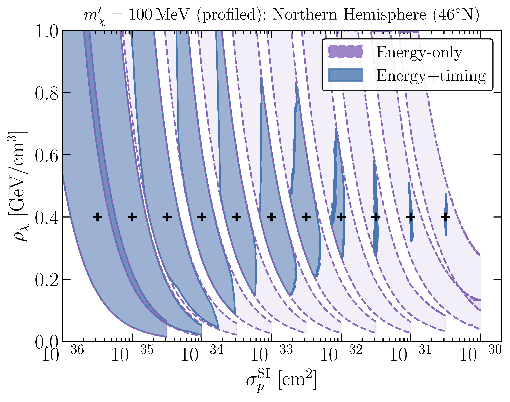
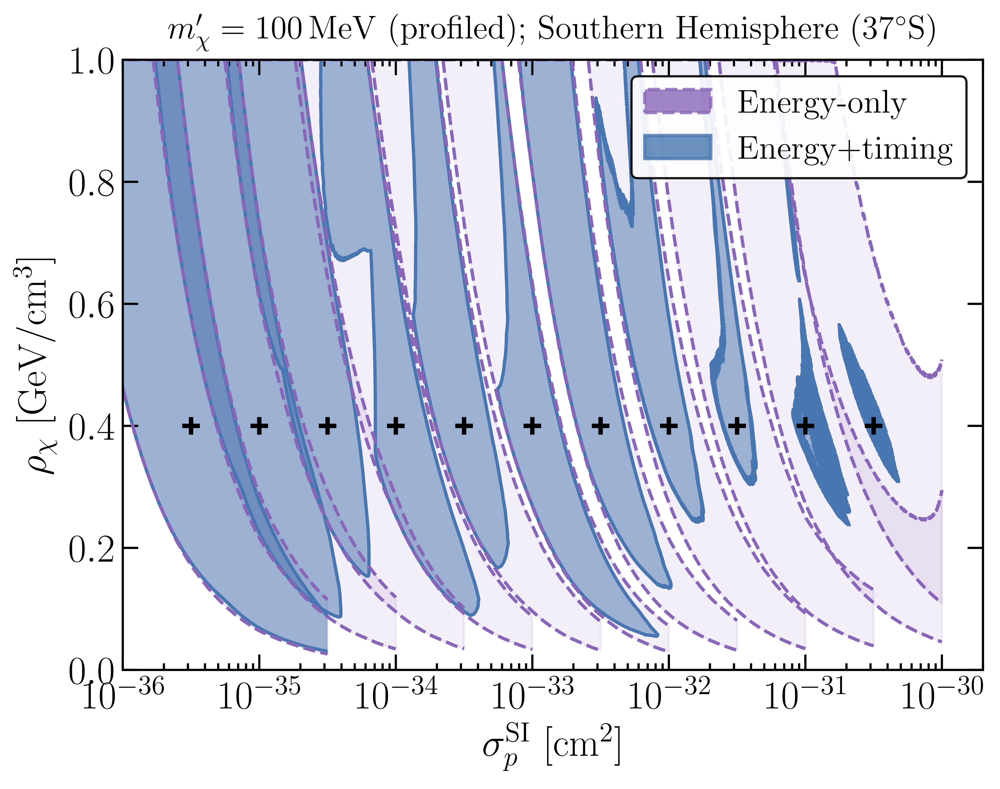

#### Results for different experimental setups

 
These plots show the reconstructed contours for a Germanium detector with the following parameters:
* Mass: 35g  
* Threshold: 100 eV  
* Resolution: 25 eV  
* Depth: 1000m  
* Exposure: 30 days  
* Background: Flat, 10 events/kg/keV/day

These results emphasise that the contours can be very sensitive to the detector sensitivity. For more details, see for example: [arXiv:2004.01621v1](https://arxiv.org/abs/2004.01621v1).